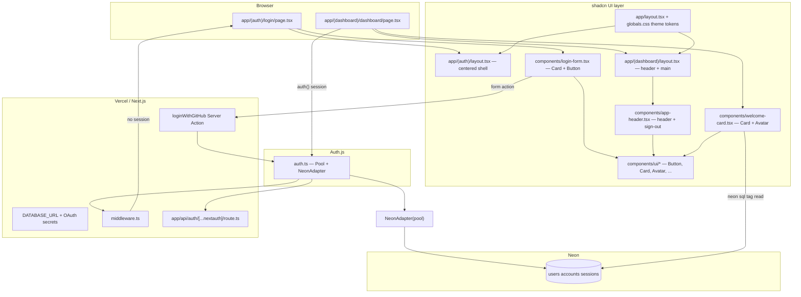

> **Original Architect Prompt:**
> Role: Senior Next.js Developer.
> Task: Implementation plan for GitHub-Only Authentication using Auth.js (NextAuth), powered by Neon Postgres via the Vercel Neon Integration.
> 
> Technical Constraints:
> 
> Auth Provider: GitHub OAuth only.
> 
> Database: Neon Postgres (Serverless).
> 
> Connection Strategy: Use the Vercel Neon Integration. No Prisma or Drizzle. Use the @auth/neon-adapter with the @neondatabase/serverless driver.
> 
> Framework: Next.js 16 (App Router) using Server Actions.
> 
> UI: shadcn/ui for all frontend surfaces — login page, dashboard, and shared layout (Tailwind CSS + Radix primitives via copied source components).
> 
> Middleware: Strict protection. Redirect unauthenticated users from /dashboard to /login.
> 
> Required Deliverables:
> 
> Dependency Setup: List the light packages needed (next-auth@5, @auth/neon-adapter, @neondatabase/serverless).
> 
> Auth Configuration: Plan the auth.ts file. Crucially, show how to initialize the Pool from @neondatabase/serverless inside the Auth configuration.
> 
> Database Initialization Script: Since we aren't using an ORM, provide a SQL script to create the required users, accounts, sessions, and verification_tokens tables in the Neon console.
> 
> Data Fetching: Plan a simple "Welcome" component for the Dashboard that fetches the user's GitHub name directly using a SQL tag (e.g., sql from @neondatabase/serverless).
> 
> Environment Variables: Map out the variables provided by the Vercel-Neon integration (e.g., DATABASE_URL).
> 
> Instructions: Output this plan in Markdown. Focus on the direct connection between Auth.js and the Neon serverless driver. Once approved, I will have you save this to auth-plan.md.

---

# GitHub-only Auth.js + Neon (Vercel integration) — implementation plan

Greenfield blueprint for **GitHub-only authentication** using **Auth.js (NextAuth v5)**, **Neon Postgres** via the **Vercel Neon integration**, and **`@auth/neon-adapter`** with **`@neondatabase/serverless`** (no Prisma or Drizzle). All user-facing UI is built with **shadcn/ui** (login, dashboard, shared layout).

Assumes a standard **Next.js 16 App Router** layout (`app/`, or `src/app/` if using `src/`).

## Technical constraints (summary)

| Area | Choice |
| --- | --- |
| Auth provider | GitHub OAuth only |
| Database | Neon Postgres (serverless), Vercel Neon integration |
| DB access | `@auth/neon-adapter` + `@neondatabase/serverless` — **no Prisma or Drizzle** |
| Framework | Next.js 16 App Router, Server Actions for OAuth trigger |
| UI | **shadcn/ui** — components copied into `components/ui/`; Tailwind CSS for styling |
| Middleware | Strict `/dashboard` protection → redirect to `/login` |

## Architecture (high level)



**Data vs UI split**

- **Sessions and user rows** are written by **Auth.js** through **`NeonAdapter(Pool)`** on sign-in.
- **Dashboard display name** is read with a **separate** Neon serverless **`neon` SQL tagged template** query keyed by the signed-in user’s database id (from `auth()`), then passed into a **shadcn `Card`** for display.
- **shadcn/ui does not participate in auth** — it only composes Server Components / Client boundaries around existing `auth()`, Server Actions, and SQL reads.

---

## 1) Dependencies (minimal set)

### Auth + database

Install (versions float to current stable; align `next-auth` with Auth.js v5 docs):

| Package | Role |
| --- | --- |
| `next-auth` | Auth.js for Next.js (`NextAuth`, `handlers`, `auth`, `signIn`, `signOut`) |
| `@auth/neon-adapter` | Official Postgres adapter implementation for Neon |
| `@neondatabase/serverless` | **`Pool`** for the adapter + **`neon` SQL tag** for raw queries |

**Install command:**

```bash
npm install next-auth @auth/neon-adapter @neondatabase/serverless
```

**Peer constraint (per npm / Auth.js docs):** `@auth/neon-adapter` expects a compatible `@neondatabase/serverless` (supports both `^0.10.x` and `^1.x` lines).

### UI — shadcn/ui (via CLI, not a single npm package)

shadcn copies component **source** into the repo. The CLI installs peer utilities on `init` and per-component on `add`:

| Installed by CLI (typical) | Role |
| --- | --- |
| `tailwindcss`, `postcss`, `autoprefixer` | Utility-first styling (from Next scaffold + shadcn) |
| `class-variance-authority`, `clsx`, `tailwind-merge` | Variants + `cn()` helper in `lib/utils.ts` |
| `@radix-ui/react-*` | Primitives per added component (e.g. `slot` for Button) |
| `lucide-react` | Icons (GitHub icon on login button, UI chrome) |

**Prerequisite:** scaffold Next.js with **Tailwind** (`create-next-app` with Tailwind enabled) before `shadcn init`.

**Init (non-interactive, agent-safe):**

```bash
npx shadcn@latest init -d
```

This creates `components.json`, theme CSS variables in `app/globals.css`, and `lib/utils.ts`.

**Components to add for this app** (install after init):

```bash
npx shadcn@latest add button card avatar separator dropdown-menu
```

Optional later: `sonner` (toasts), `skeleton` (loading states).

Optional but typical for Next 16 / TypeScript:

- `typescript`, `@types/node`, `@types/react`, `@types/react-dom` (if not already present from `create-next-app`)

---

## 2) `auth.ts` — GitHub-only + Neon `Pool` inside the Auth.js factory

**Critical rule from Auth.js Neon docs:** **do not** construct a global `Pool` at module top level for serverless/edge-friendly Next deployments. Instantiate **`new Pool({ connectionString: process.env.DATABASE_URL })` inside the `NextAuth(() => { ... })` factory** so each invocation gets a scoped pool configuration pattern recommended by Auth.js.

Planned file: `auth.ts` (or `src/auth.ts` if using `src/`).

**Shape:**

```ts
import NextAuth from "next-auth"
import GitHub from "next-auth/providers/github"
import NeonAdapter from "@auth/neon-adapter"
import { Pool } from "@neondatabase/serverless"

export const { handlers, auth, signIn, signOut } = NextAuth(() => {
  const pool = new Pool({ connectionString: process.env.DATABASE_URL })

  return {
    adapter: NeonAdapter(pool),
    providers: [
      GitHub({
        // Optional explicit mapping if you prefer non-prefixed env names:
        // clientId: process.env.GITHUB_ID,
        // clientSecret: process.env.GITHUB_SECRET,
      }),
    ],
    session: { strategy: "database" }, // explicit: adapter path is DB-backed sessions
    pages: {
      signIn: "/login", // aligns with your /login route UX
    },
    callbacks: {
      // Usually none required for “show GitHub name”; `user.name` is persisted in `users.name`
    },
    trustHost: true, // commonly needed on Vercel; verify against your deployment hostname config
  }
})
```

**Why this satisfies the constraint:** the **only** database object passed into Auth.js for persistence is **`NeonAdapter(pool)`** where `pool` is **`@neondatabase/serverless` `Pool`**, exactly as documented on [Auth.js Neon adapter](https://authjs.dev/getting-started/adapters/neon).

**Route handler wiring (App Router):** `app/api/auth/[...nextauth]/route.ts`

```ts
import { handlers } from "@/auth"
export const { GET, POST } = handlers
```

---

## 3) SQL initialization script (Neon SQL Editor)

Auth.js documents the Neon adapter schema explicitly (table names and column casing matter because of quoted identifiers like `"userId"`).

Run the following in the **Neon console** (or check in as `scripts/auth-schema.sql`). This is derived from the official Auth.js Neon schema, with **practical indexes/uniques** added for OAuth correctness and session lookup.

```sql
-- Auth.js Neon adapter baseline schema (+ helpful constraints)

CREATE TABLE users (
  id SERIAL PRIMARY KEY,
  name VARCHAR(255),
  email VARCHAR(255),
  "emailVerified" TIMESTAMPTZ,
  image TEXT
);

CREATE UNIQUE INDEX users_email_unique ON users (email);

CREATE TABLE accounts (
  id SERIAL PRIMARY KEY,
  "userId" INTEGER NOT NULL REFERENCES users(id) ON DELETE CASCADE,
  type VARCHAR(255) NOT NULL,
  provider VARCHAR(255) NOT NULL,
  "providerAccountId" VARCHAR(255) NOT NULL,
  refresh_token TEXT,
  access_token TEXT,
  expires_at BIGINT,
  id_token TEXT,
  scope TEXT,
  session_state TEXT,
  token_type TEXT
);

CREATE UNIQUE INDEX accounts_provider_account_unique
  ON accounts (provider, "providerAccountId");

CREATE TABLE sessions (
  id SERIAL PRIMARY KEY,
  "userId" INTEGER NOT NULL REFERENCES users(id) ON DELETE CASCADE,
  expires TIMESTAMPTZ NOT NULL,
  "sessionToken" VARCHAR(255) NOT NULL
);

CREATE UNIQUE INDEX sessions_sessionToken_unique ON sessions ("sessionToken");

CREATE TABLE verification_token (
  identifier TEXT NOT NULL,
  expires TIMESTAMPTZ NOT NULL,
  token TEXT NOT NULL,
  PRIMARY KEY (identifier, token)
);
```

**Note on naming:** Auth.js docs use `verification_token` (singular), not `verification_tokens`. Use **`verification_token`** to match the adapter.

---

## 4) Middleware — strict `/dashboard` protection

Planned file: `middleware.ts`

**Goal:** if a request targets `/dashboard` (and nested routes), **require `auth()`**; otherwise redirect to **`/login`**.

Recommended approach: compose Auth.js middleware with a small matcher and an explicit guard:

- **Matcher:** include `/dashboard/:path*` and **exclude** static assets (`/_next/static`, `/_next/image`, favicon) per Next.js middleware best practices.
- **Logic:** `const session = await auth()`; if missing and path is under `/dashboard`, `NextResponse.redirect(new URL("/login", request.url))`.

Also ensure `/login` itself is **not** caught in an accidental redirect loop (only protect `/dashboard`).

**API routes:** `/api/auth/*` must remain reachable unauthenticated (handled by matcher exclusions or pathname checks).

**Example sketch:**

```ts
import { auth } from "@/auth"
import { NextResponse } from "next/server"

export default auth((req) => {
  if (!req.auth && req.nextUrl.pathname.startsWith("/dashboard")) {
    return NextResponse.redirect(new URL("/login", req.nextUrl))
  }
})

export const config = {
  matcher: ["/dashboard/:path*"],
}
```

---

## 5) UI shell — layouts + shadcn composition

**Route groups** keep auth and app chrome separate:

| Path | File | UI role |
| --- | --- | --- |
| `/` | `app/layout.tsx` | Root: `html`/`body`, `globals.css` theme, optional `font-sans` |
| `/login` | `app/(auth)/layout.tsx` | Minimal centered column (full viewport, muted background) |
| `/login` | `app/(auth)/login/page.tsx` | Renders `<LoginForm />` only |
| `/dashboard` | `app/(dashboard)/layout.tsx` | App shell: `<AppHeader />` + `<main>` for children |
| `/dashboard` | `app/(dashboard)/dashboard/page.tsx` | Server page: `auth()` + SQL → `<WelcomeCard name={...} />` |

**Shared components** (all shadcn-backed):

- `components/login-form.tsx` — `Card`, `CardHeader`, `CardTitle`, `CardDescription`, `CardContent`; `Button` with `formAction={loginWithGitHub}` (Server Action).
- `components/app-header.tsx` — product title, `Avatar` (session image), `DropdownMenu` with **Sign out** (`signOut()` Server Action).
- `components/welcome-card.tsx` — `Card` showing “Welcome, {name}” and optional `Avatar`.

**Theming:** use default shadcn CSS variables (`--background`, `--primary`, etc.) in `globals.css`; no custom design system required for v1.

---

## 6) `/login` + Server Actions (GitHub OAuth)

Planned route: `app/(auth)/login/page.tsx`  
Planned UI: `components/login-form.tsx`

**Server Action** (colocated `app/actions/auth.ts` or inside the form module):

```ts
"use server"

import { signIn } from "@/auth"

export async function loginWithGitHub() {
  await signIn("github", { redirectTo: "/dashboard" })
}
```

**Login UI (shadcn):**

```tsx
import { Button } from "@/components/ui/button"
import { Card, CardContent, CardDescription, CardHeader, CardTitle } from "@/components/ui/card"
import { loginWithGitHub } from "@/app/actions/auth"

export function LoginForm() {
  return (
    <Card className="w-full max-w-sm">
      <CardHeader>
        <CardTitle>Sign in</CardTitle>
        <CardDescription>Use your GitHub account to continue.</CardDescription>
      </CardHeader>
      <CardContent>
        <form action={loginWithGitHub}>
          <Button type="submit" className="w-full">
            Continue with GitHub
          </Button>
        </form>
      </CardContent>
    </Card>
  )
}
```

---

## 7) Dashboard “Welcome” — fetch GitHub display name via SQL tag

Use **`neon`** from `@neondatabase/serverless` for tagged-template queries (distinct from the adapter’s `Pool`, but same integration `DATABASE_URL`).

**Server Component approach (simplest):** `app/(dashboard)/dashboard/page.tsx` fetches data; `components/welcome-card.tsx` renders UI.

1. `const session = await auth()`
2. If no session, rely on middleware (defense in depth: still `redirect("/login")`).
3. Parse `session.user.id` as the **integer** primary key for `users.id` (DB session strategy).
4. Query:

```ts
import { neon } from "@neondatabase/serverless"

const sql = neon(process.env.DATABASE_URL!)
const rows = await sql`select name from users where id = ${Number(session.user.id)} limit 1`
const displayName = rows[0]?.name ?? session.user.name ?? "GitHub user"
```

5. Pass `displayName` and `session.user.image` into `<WelcomeCard />` (shadcn `Card` + `Avatar`).

**Operational note:** Vercel’s Neon integration may provide both pooled and unpooled URLs (`DATABASE_URL_UNPOOLED`, `POSTGRES_URL_NON_POOLING`, etc.). For a read-only `SELECT`, either often works—confirm which URL Neon documents for **serverless queries** in your project settings.

---

## 8) Environment variables — Vercel Neon integration + GitHub + Auth.js

### From Vercel ↔ Neon integration (typical)

Neon’s Vercel integration usually injects Postgres URLs into the Vercel project. Names can vary slightly by integration version, but expect variants of:

| Variable | Typical use |
| --- | --- |
| `DATABASE_URL` | General-purpose connection string (Auth.js adapter + `neon` queries) |
| `POSTGRES_URL` | Alternate naming in some templates |
| `DATABASE_URL_UNPOOLED` / `POSTGRES_URL_NON_POOLING` | Direct / serverless-friendly connections |

**Plan:** in Vercel Project Settings → Environment Variables, confirm the exact keys Neon provisioned, then set **`DATABASE_URL` for Auth.js** explicitly (use Neon’s `DATABASE_URL` directly, or copy the correct string into `DATABASE_URL` if Neon used a different key).

For **local development**, mirror the same variables in `.env.local` (never commit secrets).

### GitHub OAuth app

Create a GitHub OAuth App:

- **Authorization callback URL:** `https://<your-production-domain>/api/auth/callback/github`
- For local dev, add `http://localhost:3000/api/auth/callback/github`

Auth.js GitHub provider env vars (per Auth.js docs):

| Variable | Purpose |
| --- | --- |
| `AUTH_GITHUB_ID` | GitHub OAuth App client ID |
| `AUTH_GITHUB_SECRET` | GitHub OAuth App client secret |

(Older convention `GITHUB_ID` / `GITHUB_SECRET` appears in many tutorials; Auth.js documents the `AUTH_`-prefixed names.)

### Auth.js core secrets / URLs

| Variable | Purpose |
| --- | --- |
| `AUTH_SECRET` | Required in production (strong random string) |
| `AUTH_URL` | Canonical site URL on Vercel (helps callback URL construction) |

---

## 9) File checklist (implementation order)

1. Scaffold Next 16 App Router with **TypeScript + Tailwind**.
2. **Initialize shadcn:** `npx shadcn@latest init -d`; add `button`, `card`, `avatar`, `separator`, `dropdown-menu`.
3. Add auth dependencies; apply SQL schema in Neon.
4. Add `auth.ts` with **Pool-in-factory** + `NeonAdapter` + GitHub provider.
5. Add `app/api/auth/[...nextauth]/route.ts`.
6. Add `middleware.ts` with `/dashboard` protection.
7. Add root + route-group layouts (`app/layout.tsx`, `(auth)/layout.tsx`, `(dashboard)/layout.tsx`).
8. Add `components/login-form.tsx` + `app/(auth)/login/page.tsx` + `loginWithGitHub` action.
9. Add `components/app-header.tsx` (sign-out) + `components/welcome-card.tsx`.
10. Add `app/(dashboard)/dashboard/page.tsx` with `auth()` + `neon` SQL → `WelcomeCard`.

---

## 10) Post-implementation verification (manual)

- Visit `/dashboard` logged out → redirected to `/login`.
- Login page shows centered shadcn **Card** and full-width **Button**.
- Click GitHub sign-in → OAuth → lands on `/dashboard` inside **dashboard layout** (header visible).
- Confirm rows appear in `users`, `accounts`, `sessions`.
- Dashboard **WelcomeCard** shows DB `users.name` (and falls back sensibly); **Avatar** uses GitHub image when present.
- Sign out from header **DropdownMenu** clears session and returns to `/login`.

---

## Implementation todos

### Scaffold + UI foundation

- [ ] Create Next.js 16 app (App Router, TypeScript, **Tailwind CSS**)
- [ ] Run `npx shadcn@latest init -d` (creates `components.json`, `lib/utils.ts`, theme in `globals.css`)
- [ ] Run `npx shadcn@latest add button card avatar separator dropdown-menu`
- [ ] Add route-group layouts: `app/(auth)/layout.tsx`, `app/(dashboard)/layout.tsx`
- [ ] Build `components/login-form.tsx`, `components/app-header.tsx`, `components/welcome-card.tsx`

### Auth + database

- [ ] Add `next-auth`, `@auth/neon-adapter`, `@neondatabase/serverless`
- [ ] Run Neon SQL script (`users`, `accounts`, `sessions`, `verification_token` + indexes)
- [ ] Implement `auth.ts`: Pool inside NextAuth factory, NeonAdapter, GitHub-only, DB sessions
- [ ] Wire `app/api/auth/[...nextauth]/route.ts` to handlers
- [ ] Add `middleware.ts`: unauthenticated `/dashboard` → `/login` with safe matcher
- [ ] Add `loginWithGitHub` / `signOut` Server Actions; wire login **Button** and header **DropdownMenu**
- [ ] Add `app/(auth)/login/page.tsx` and `app/(dashboard)/dashboard/page.tsx` (`auth()` + `neon` SQL → `WelcomeCard`)
- [ ] Map Vercel Neon vars to `DATABASE_URL` + set `AUTH_*` + GitHub OAuth callback URL
